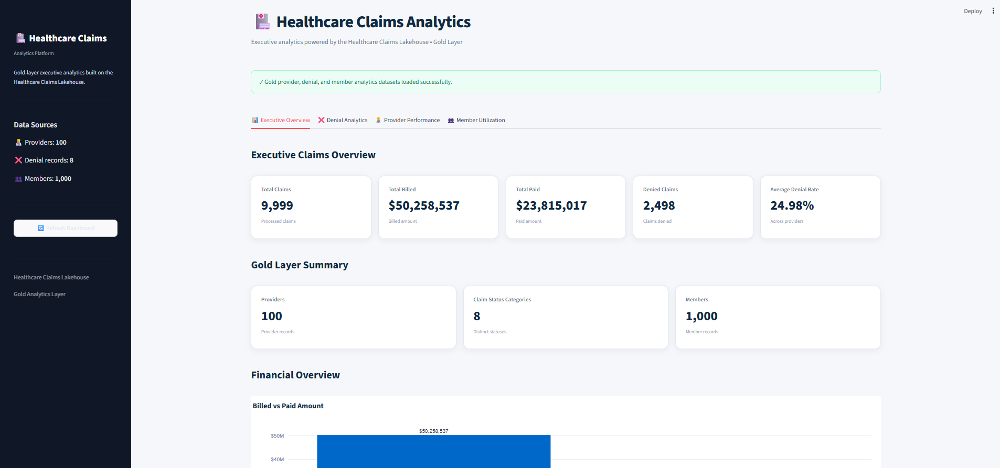
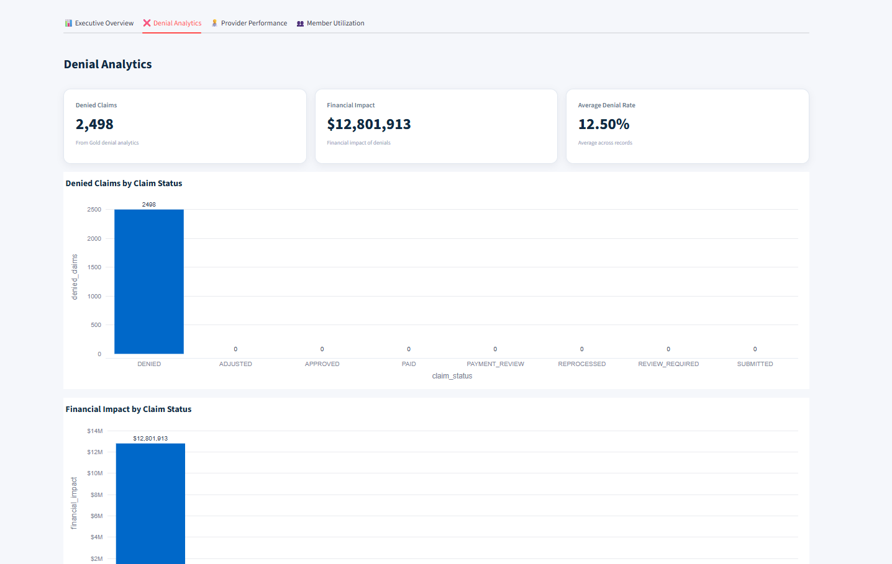
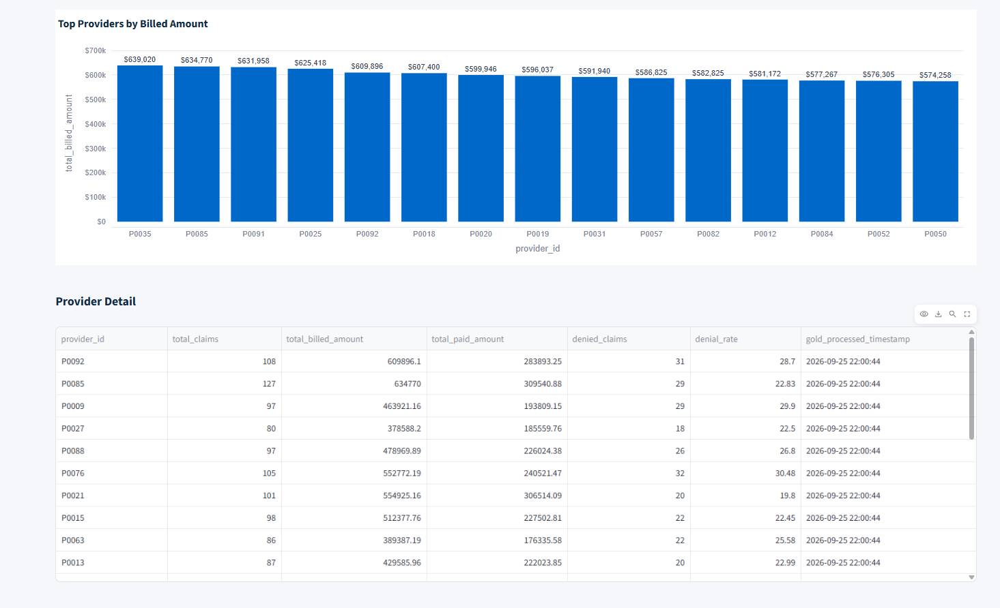
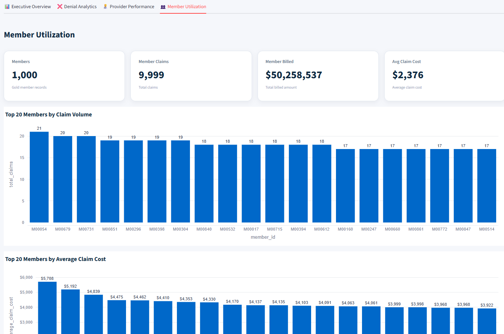
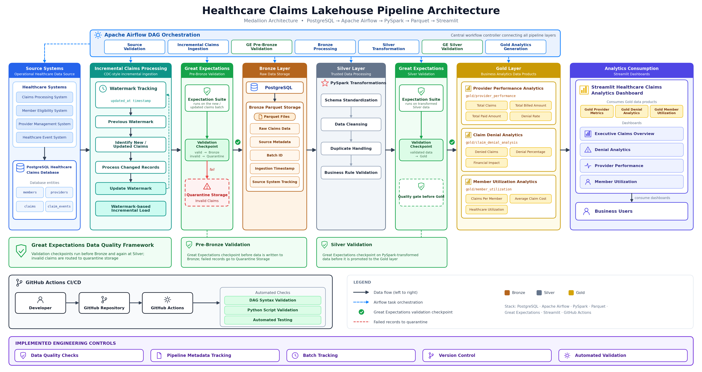

````markdown
# 🏥 Healthcare Claims Lakehouse Pipeline



A production-style **Healthcare Claims Lakehouse Analytics Platform** built using modern data engineering practices. This project demonstrates an end-to-end healthcare data pipeline that ingests claims data, applies **Medallion Architecture**, performs automated data quality validation, creates business-ready Gold analytics datasets, and delivers executive insights through an interactive **Streamlit analytics dashboard**.

---

# 📊 Streamlit Analytics Dashboard

The Gold analytics layer powers an interactive Streamlit dashboard providing:

- Executive Claims Overview
- Claim Denial Analytics
- Provider Performance Analysis
- Member Utilization Analytics

Dashboard capabilities include:

- Executive KPI monitoring
- Claims volume analysis
- Financial impact analysis
- Provider benchmarking
- Denial trend analysis
- Member utilization insights
- Gold layer analytics exploration


## Dashboard Screenshots

### Executive Claims Overview


### Denial Analytics




### Provider Performance




### Member Utilization



---

# 🏗️ Architecture



The platform follows a **Medallion Lakehouse Architecture**:

```text
Source Systems
      |
      v
PostgreSQL Healthcare Claims Database
      |
      v
Apache Airflow Orchestration
      |
      v
PySpark Processing
      |
      v
Bronze Layer
      |
      v
Silver Layer
      |
      v
Gold Analytics Layer
      |
      v
Streamlit Dashboard
````

---

# 🔄 Pipeline Overview

## Source Systems

Healthcare claims data originates from operational healthcare systems:

* Claims Processing System
* Member Eligibility System
* Provider Management System
* Healthcare Event System

Source data is stored in a PostgreSQL healthcare claims database.

---

# 🥉 Bronze Layer — Raw Data Storage

The Bronze layer stores raw healthcare claims data after ingestion.

Responsibilities:

* Raw claims ingestion
* Source metadata tracking
* Batch identification
* Ingestion timestamp tracking
* Historical preservation

Storage format:

* Parquet

---

# 🥈 Silver Layer — Trusted Data Processing

The Silver layer applies PySpark transformations to create trusted analytical datasets.

Processing includes:

* Schema standardization
* Data cleansing
* Duplicate handling
* Business rule validation
* Transformation logic

---

# 🥇 Gold Layer — Business Analytics Products

The Gold layer contains curated analytical datasets consumed by the Streamlit dashboard.

---

## Provider Performance Analytics

Dataset:

```text
gold/provider_performance
```

Provides:

* Provider claim volume
* Total billed amount
* Total paid amount
* Denied claims
* Denial rates

---

## Claim Denial Analytics

Dataset:

```text
gold/claim_denial_analysis
```

Provides:

* Claim status analysis
* Denied claims
* Denial percentage
* Financial impact analysis

---

## Member Utilization Analytics

Dataset:

```text
gold/member_utilization
```

Provides:

* Member claim volume
* Total billed amount
* Total paid amount
* Average claim cost
* Service history

---

# ✅ Data Quality Framework

The pipeline uses **Great Expectations** for automated data validation.

Validation checkpoints are implemented throughout the pipeline.

---

## Pre-Bronze Validation

Incoming healthcare claims data is validated before entering Bronze storage.

Validation ensures:

* Schema correctness
* Required fields availability
* Data consistency

Invalid records are routed to:

```text
Quarantine Storage
```

---

## Silver Layer Validation

Transformed Silver data is validated before promotion into the Gold analytics layer.

Checks include:

* Data completeness
* Business rule validation
* Data consistency
* Transformation accuracy

---

# ⚙️ Technology Stack

## Data Engineering

* Python
* PySpark
* Apache Airflow
* PostgreSQL
* Parquet

## Data Quality

* Great Expectations

## Analytics

* Streamlit
* Plotly
* Pandas

## DevOps

* Docker
* GitHub
* GitHub Actions

---

# 🚀 Running the Project

## Clone Repository

```bash
git clone <repository-url>

cd healthcare-claims-pipeline
```

---

## Install Dependencies

```bash
pip install -r requirements.txt
```

---

## Run Streamlit Dashboard

```bash
streamlit run dashboard/app.py
```

Dashboard URL:

```text
http://localhost:8501
```

---

# 📂 Project Structure

```text
healthcare-claims-pipeline/

├── airflow/
│
├── data/
│   ├── bronze/
│   ├── silver/
│   └── gold/
│
├── dashboard/
│   └── app.py
│
├── docs/
│   ├── architecture.png
│   └── screenshots/
│
├── great_expectations/
│
├── src/
│
├── tests/
│
├── README.md
└── requirements.txt
```

---

# 🔁 CI/CD

GitHub Actions performs automated validation including:

* DAG syntax validation
* Python script validation
* Automated testing

---

# 🔐 Engineering Controls

Implemented engineering controls:

* Data quality validation checkpoints
* Pipeline metadata tracking
* Batch tracking
* Version control
* Automated validation
* Quarantine handling

---

# 📈 Business Value

This platform enables healthcare organizations to:

* Identify claim denial patterns
* Monitor provider performance
* Analyze financial impact
* Understand member utilization behavior
* Provide trusted analytics for operational decision-making

---

# 👨‍💻 Healthcare Claims Lakehouse Analytics Platform

Built using modern data engineering practices, lakehouse architecture patterns, and analytics engineering principles.

```
```
